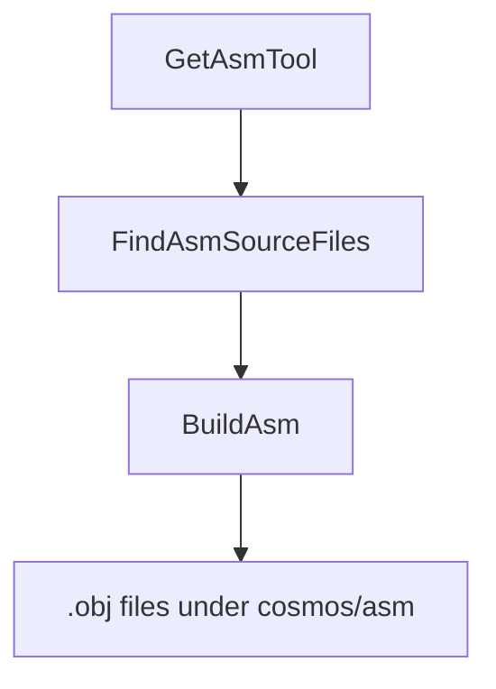

`Cosmos.Build.Asm` compiles handwritten assembly sources into object files that are linked with the NativeAOT output. Both x64 and ARM64 targets use the **clang integrated assembler** on GAS-syntax `.s` files.

---

## Flow chart

---

## Parameters

| Name | Description | Default |
| --- | --- | --- |
| `AsmToolPath` | Full path to the `clang` executable. Auto-detected by `GetAsmTool` if not set. | Resolved via `ResolveCosmosToolTask` (system PATH + Cosmos tools bundle) |
| `AsmSearchPath` | One or more directories to scan (non-recursive) for `*.s`. | none |
| `AsmFiles` | Explicit list of `*.s` files to compile (added to scan results). | none |
| `AsmOutputPath` | Directory for compiled object files. | `$(IntermediateOutputPath)/cosmos/asm/` |

Notes:
- When `RuntimeIdentifier` is set (e.g., `linux-x64`), `FindAsmSourceFiles` will prefer an architecture subfolder if present (e.g., `<searchDir>/x64/`).
- The target triple is selected by `AsmBuildTask` from `TargetArchitecture`: `x86_64-elf` for x64 and `aarch64-none-elf` for ARM64.

---

## Tasks

| Task | Description | Depends On |
| --- | --- | --- |
| `GetAsmTool` | Resolves `AsmToolPath` to the clang binary via `ResolveCosmosToolTask`. | none |
| `FindAsmSourceFiles` | Cleans inputs, applies arch overrides, and discovers `*.s` under `AsmSearchPath`. | `Build` |
| `BuildAsm` | Invokes `AsmBuildTask` for each file with `--target=<triple> -c`, writing to `AsmOutputPath`. | `FindAsmSourceFiles; GetAsmTool` |
| `CleanAsm` | Removes `$(IntermediateOutputPath)/cosmos/asm/`. | `Clean` |

---

## Detailed Workflow

1. `GetAsmTool` resolves `AsmToolPath` to a `clang` binary (override / system / Cosmos tools bundle).
2. `FindAsmSourceFiles`:
   - Removes any nonexistent entries from `AsmSearchPath` and `AsmFiles` (emits warnings).
   - If `RuntimeIdentifier` is set, replaces any `AsmSearchPath` that contains a matching arch subfolder with that subfolder (e.g., `x64`).
   - Builds a non-recursive search pattern `%(AsmSearchPath.FullPath)/*.s` and adds results to `AsmFiles` (deduplicated).
3. `BuildAsm` calls the `AsmBuildTask` for each file:
   - Computes a SHA1 of the source and emits `<name>-<sha1>.obj` into `AsmOutputPath`.
   - Executes `clang --target=<x86_64-elf|aarch64-none-elf> -c -o <output.obj> <input.s>`.
4. `CleanAsm` deletes the `cosmos/asm` intermediate folder during `Clean`.

---

## Outputs

- Object files in `$(IntermediateOutputPath)/cosmos/asm/` named as `<sourceName>-<sha1>.obj` where `<sha1>` is the content hash of the source. This guarantees deterministic, cache-friendly names across builds.

---

## Related components

- [`Cosmos.Build.Asm`](../../../src/Cosmos.Build.Asm)
