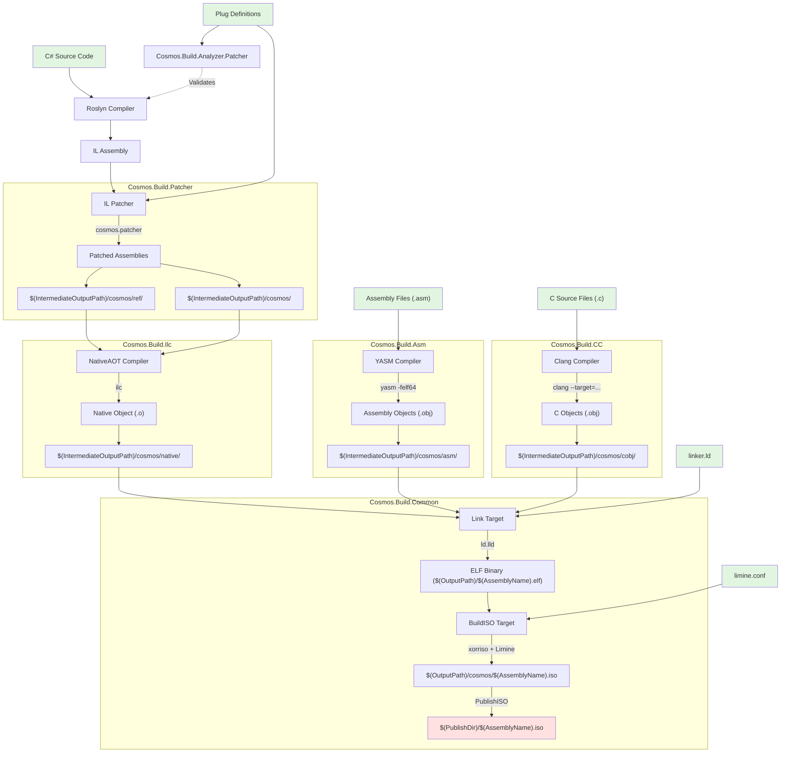

# Kernel Compilation Steps

This document outlines the complete build pipeline that transforms C# kernel code into a bootable ISO image using .NET NativeAOT compilation, custom IL patching, and native code generation.

## Compilation Flow Chart

## Prerequisites

| Tool | Purpose | Required Version |
|------|---------|-----------------|
| **.NET SDK** | Core compilation | 10.0+ |
| **Clang** | C compilation (x64/ARM64 via --target) | LLVM toolchain |
| **YASM** | x64 assembly compilation | Latest |
| **ld.lld** | ELF linking | LLVM toolchain |
| **xorriso** | ISO creation | Latest |

## Key Components

- [`Cosmos.Sdk`](../../../src/Cosmos.Sdk) - MSBuild SDK orchestration
- [`Cosmos.Build.Patcher`](../../../src/Cosmos.Build.Patcher) - IL patching infrastructure
- [`Cosmos.Build.Ilc`](../../../src/Cosmos.Build.Ilc) - NativeAOT integration
- [`Cosmos.Build.Asm`](../../../src/Cosmos.Build.Asm) - Assembly compilation
- [`Cosmos.Build.CC`](../../../src/Cosmos.Build.CC) - C compilation (Clang)
- [`Cosmos.Build.Common`](../../../src/Cosmos.Build.Common) - Linking and ISO creation

## Example Project

Reference implementation: `examples/DevKernel/DevKernel.csproj`

## Output Summary

| Stage | Output Path | Content |
|-------|------------|---------|
| Patching | `$(IntermediateOutputPath)/cosmos/` | Main patched assembly |
| Patching | `$(IntermediateOutputPath)/cosmos/ref/` | Reference assemblies |
| NativeAOT | `$(IntermediateOutputPath)/cosmos/native/` | Native object files (.o) |
| Assembly | `$(IntermediateOutputPath)/cosmos/asm/` | YASM objects (.obj) |
| C Code | `$(IntermediateOutputPath)/cosmos/cobj/` | Clang objects (.o/.obj) |
| Linking | `$(OutputPath)/$(AssemblyName).elf` | Linked ELF kernel |
| ISO | `$(OutputPath)/cosmos/$(AssemblyName).iso` | Bootable ISO image |
| Publish | `$(PublishDir)/$(AssemblyName).iso` | Published ISO |

