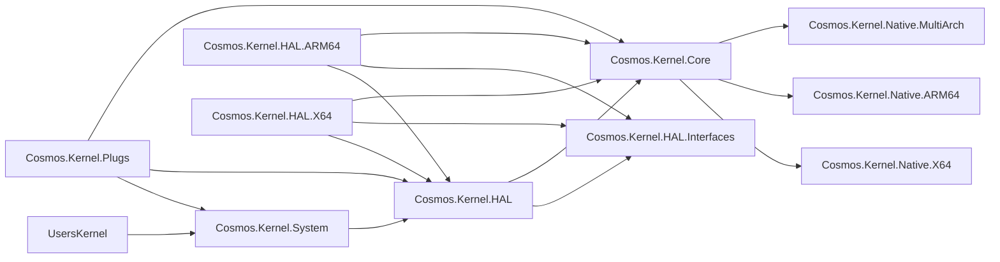

# Kernel Project Layout

The Cosmos kernel is composed of layered projects to enforce a clean dependency graph. Dependencies flow **downward only** — a project must never reference a project above it in the hierarchy.

## Dependency Graph

## Project Descriptions

| Project | Purpose |
|---------|---------|
| **Cosmos.Kernel.System** | High-level OS APIs: Console, Graphics, Network, Timer, Mouse. The layer user kernels interact with. |
| **Cosmos.Kernel.HAL** | Hardware Abstraction Layer — shared logic, platform registration (`PlatformHAL`), device managers. |
| **Cosmos.Kernel.HAL.Interfaces** | Pure interfaces (`IPlatformInitializer`, `ICpuOps`, `IKeyboardDevice`, etc.). No implementations. |
| **Cosmos.Kernel.HAL.X64** | x86-64 HAL implementations (PCI, APIC, PS/2, ACPI, etc.). |
| **Cosmos.Kernel.HAL.ARM64** | ARM64 HAL implementations (GIC, PL011, virtio, etc.). |
| **Cosmos.Kernel.Core** | Low-level runtime: memory management, GC, scheduler, serial I/O, panic handler. |
| **Cosmos.Kernel.Native.X64** | x86-64 assembly files (`.s`, GAS syntax) — interrupt stubs, context switching, SIMD. |
| **Cosmos.Kernel.Native.ARM64** | ARM64 assembly files (`.s`, GAS syntax) — exception vectors, context switching. |
| **Cosmos.Kernel.Native.MultiArch** | Cross-platform native C code (ACPI, libc stubs). |
| **Cosmos.Kernel.Plugs** | IL-level method replacements for BCL types (`Console`, `Thread`, `Environment`, etc.). |
| **Cosmos.Kernel.Boot.Limine** | Limine bootloader protocol integration. |
| **Cosmos.Kernel** | Base `Kernel` version info and shared kernel constants. |

## Build System Projects

| Project | Purpose |
|---------|---------|
| **Cosmos.Build.Patcher** | IL patcher — applies plugs and patches at build time. |
| **Cosmos.Build.Ilc** | Custom ILC (IL Compiler) integration for NativeAOT. |
| **Cosmos.Build.Asm** | Clang assembly compilation (GAS-syntax `.s` files for both x64 and ARM64). |
| **Cosmos.Build.CC** | Clang cross-compilation for x64 and ARM64 bare-metal targets. |
| **Cosmos.Build.Common** | Shared build props, architecture picker. |
| **Cosmos.Build.API** | Plug attributes (`[Plug]`, `[PlugMember]`) and enums. |
| **Cosmos.Build.Analyzer.Patcher** | Roslyn analyzer for plug correctness. |

## Rules

- **Never** reference upward (Core must not reference HAL or System)
- **Never** reference a platform-specific HAL project from Core
- Cross-cutting concerns (memory, scheduler, serial) go in **Core**
- Platform-specific implementations go in **HAL.X64** / **HAL.ARM64**
- User-facing APIs go in **System**
- All hardware interfaces are defined in **HAL.Interfaces**

For coding style and implementation patterns, see [Coding Guidelines](coding-guidelines.md).
